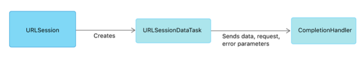
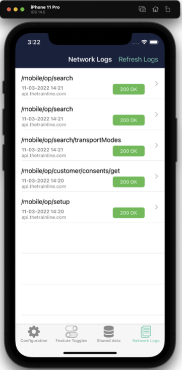
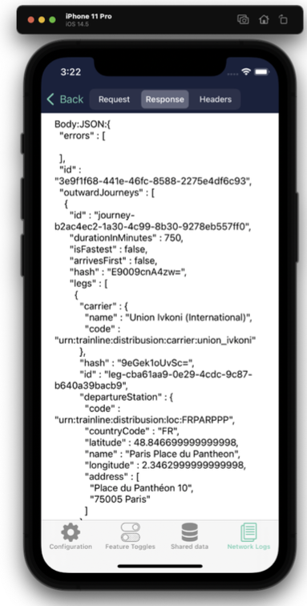
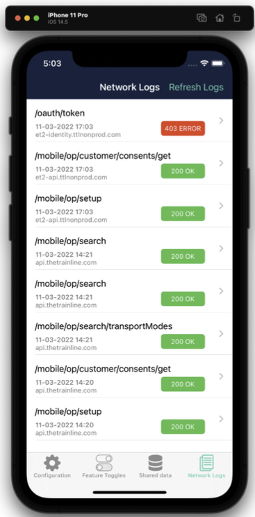

# Using network logging to diagnose issues during release testing.

## The problem
Many software companies build technology by employing multiple teams to tackle numerous problems at once. This is true of Trainline. We have Web, Mobile, Data Science, Database, and Backend teams - each with their own projects that enable Trainline to provide value to our customers.
When these teams interact with each other it can be helpful to employ some tracer rounds to diagnose problems as requests make their way through multiple, disparate systems. Within Trainline we call these tracer rounds "Conversation IDs". These IDs have some information baked into them based on the client that sends them.
In the iOS team we noticed that - frequently - when doing release testing, we would come across bugs or issues when interacting with back end services that we didn't know how to diagnose without some help from another team. This conversation id is critical to diagnosing the issue in a timely fashion, and without it, you are making the process tedious and frustrating for the person helping you. If you don't have it the ability to debug your issue becomes more difficult.

## Proxies
At this point you may say "Use a proxy!". This is generally how information sent via network requests is sniffed. Proxies are great, but they have a few issues when debugging from physical devices, like the iPhones we do our release testing on.

* You need prior knowledge something is going to go wrong. Not having the proxy enabled when you spot a bug means you've lost the information.
* iOS has a few on device proxies, but they are very costly for teams. Any software cost for teams has to go through some process to get signed off, or you can go down the "cowboy" route and charge it to your personal card hoping to re-coup the cost later. Not advised!
* Non-technical team members, like designers, business analysts, etc may have issues understanding the complicated dance to get a traditional proxy working. They need to start the proxy on their laptop, connect to it via their phones WiFi settings, install an SSL certificate, and dance with VPN settings on their laptop and phone.

There is lots of friction here, and that friction was leading to us leaving bugs in limbo on our Slack support channels. Without having the crucial information to help pinpoint the failing request, the incentive to help was very low. There had to be a better way.

## A solution?
I had a thought of fixing this by logging requests on the device itself. Rather than using a proxy to rely on capturing traffic, could we instead passively log requests, then when something went wrong, go back and check the logged requests. So I started a project in earnest. I called it "Network Logger". Not very creative naming - I know.

Some context and requirements;
* We didn't want to enable this logging in production. The size of the logs and the security impact of logging raw requests wasn't something we wanted to expose our customers too.
* Trainline has an internally distributed application called "Configurator" that enables us to configure the main Trainline application. These two applications use a shared app group, so both applications can read and write to the store.
* This couldn't have any noticeable overhead. We didn't want to give the impression that our application was slowing down just for the sake of adding some (admittedly helpful) logging.

So with this in mind, I started looking into the technical details of network logging on iOS.

## Details of technical solution

### URL Protocol

iOS passes network requests through a pipeline known as the URL Loading System (Documentation).

This system can enable you to write application code that can then retrieve data from network requests and hold it in memory. This system is protocol agnostic - so while we only care about http(s) here, you can use this system to hook into protobuf or web-socket network traffic too.

The Foundation framework has a protocol called [URL Protocol](Apple Documentation for URLProtocol) that enables us to manipulate URL requests. By registering a subclass of URLProtocol and
URLSessionDelegate you can then start intercepting requests. We called our subclass NetworkInterceptor.

For out first requirement we want to ensure our URLProtocol subclass doesn't get invoked in our production application. To do that we make the class conform to a protocol called TTLApplicationinitializer which is a protocol we use to execute some code in our Application Delegate - before the application launches. In this initialization code we check if we have the network logging flag enabled, which can only be done through our internal application.

Once that is done, then we try to create a store, and if that succeeds - we then register the by calling . The engine is our dependency injection container.
If we can't create the store then we just silently return back to the Application Delegate - this is debug logging for Trainline employees so we don't want to stop execution of the program if it fails to initialise.

Initialising the store and registering our implementation of URLProtocol, NetworkInterceptor;
```swift
#if AUTOMATION
return
#endif
if let configuration = Configuration.current(), configuration.isNetworkLoggingEnabled {
  if let storeURL = TSDLibraryDirectoryURL()?.appendingPathComponent(
      "NetworkLogger/store",
      isDirectory: true)
  {
    engine.networkLogger.initStore(url: storeURL) { result in
      switch result {
        case .success(_):
          NetworkInterceptor.register()
        default:
            return
      } 
    }
  }
}
```

The register function is pretty simple - unregister is similar;
```swift
@objc public class func register() {
  URLProtocol.registerClass(self)
}
```
Now that the class is registered, we want to start writing requests to disk. Let's walk through that.

To start reading the content of requests we override a function from URLProtocol called startLoading.

This will be called at some point after URLSession creates a URLDataSessionTask.



Then inside our startLoading function we set a header to make sure we can tell if a request has been logged, and then we parse the data out using a mapper, networkLogMapper.

```swift
override public func startLoading() {
  guard let newRequest = (self.request as NSURLRequest).mutableCopy() as? NSMutableURLRequest else {
    return
  }
  URLProtocol.setProperty(true, forKey: HeaderKeys.networkLoggerKey, in: newRequest)
    let session = Foundation.URLSession(configuration: URLSessionConfiguration.default, delegate: self, delega
        teQueue: nil)
    let startingDate = Date()
```
Now we deal with errors, as we do want to log those;

```swift
    session.dataTask(with: newRequest as URLRequest, completionHandler: { (data, response, error) -> Void in
        if let error = error {
        self.client?.urlProtocol(self, didFailWithError: error)
        guard let response = response else {
        return }
        if let log = self.engine.networkLogMapper.map(request: self.request,
            response: response,
            error: error,
            requestTime: startingDate) {
        self.engine.networkLogger.storeLogInMemory(log)
        }
        return 
        }
```

Next we deal with the successful case in much the same way;

```swift
  guard let response = response, let data = data else { return }
    self.client?.urlProtocol(self, didReceive: response, cacheStoragePolicy: URLCache.StoragePolicy.allowed)
    self.client?.urlProtocol(self, didLoad: data)
    self.client?.urlProtocolDidFinishLoading(self)
    if let log = self.engine.networkLogMapper.map(request: self.request, response: response, data: data, requestTime: startingDate) {
      self.engine.networkLogger.storeLogInMemory(log)
    }
  }).resume()
}
```

Now anytime a request is made through URLSession it will be first stored to an in-memory cache, then once that cache fills up we flush the log objects to disk. This is handled in networkLogger.storeLogInMemory.

### Shared Containers


As mentioned before, both Trainline and Configurator use a shared app group (https://developer.apple.com/documentation/bundleresources/entitlements/com_apple_security_application-
groups). This enables multiple processes on iOS to communicate with shared containers using IPC. So now we can save the log in Trainline and read it in Configurator.
Here is an example of a list of logs in the Configurator app;


And here is what the detail view looks like;

We plan to make the detail view nicer in the future, as well as adding a search bar so you can quickly look through the JSON.

Here you can see where the value in network logger comes in when diagnosing errors. In our list we have a 403 error. You can open this log and see why that request failed, rather than having to hook up a debugger.

This comes in very handy every week when we test our new release on physical devices, which are significantly more difficult to connect to a proxy than a simulator is.


## Feedback
Since releasing the network logger we've found it much simpler to diagnose network errors when doing our weekly release testing. Another area we've found the network logger to be helpful is during bug hunts for new features we are releasing.

There was a production bug that has been in our code base for a while that was un-earthed because we noticed a failed request in the logs in an area of the application that silently failed with no user facing error when you failed backend phone number validation. That issue has now been fixed with the help of Network Logger!

When interfacing with new endpoints having the logger on is a huge time saver when something goes wrong because you can simply go back and view what the API returned you.

There have been a number of feature requests since launching it, which shows the feature is engaging and being used heavily by our developers.
